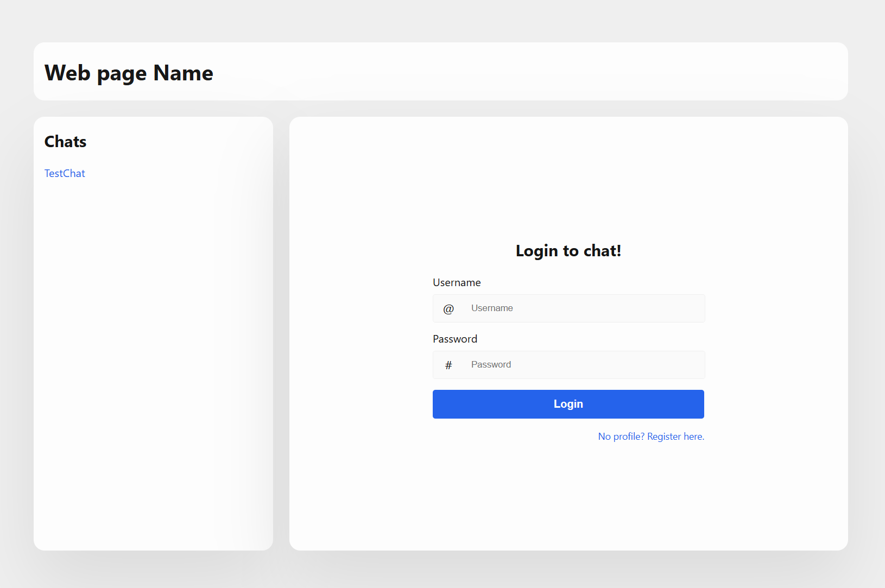

Don't Repeat Yourself.
Single Responsibility

# Obigatorisk Chat Projekt

"Chat" site build with Node express, express-session and pug. Styled with .css.

Server is at localhost:8260 so run this (node app.js) before accessing the site
at [localhost:8260](http://localhost8260/ "localhost:8260").<br>
Create your own "account", or login using Username: Admin, password: admin. Page is case-sensitive.



It has build-in check of user validity e.i. user is logged in, as well as a check on administrator rights to restrict
access to sensitive functions and pages.

Methods to delete and edit chats have been created, but are not implemented yet. 

Below are methods and routes:

```javascript
// Join chat route
chatRouter.get("chats/join/:id", (req, res) => {
    if (req.session.isValidUser) {
        ChatController.addUserToChat(req.params.id, req.session.userId)
        res.redirect(`/?chatId=${req.params.id}`)
    else
        {
            res.status(403)
            render("403")
        }
    }
})
```
```javascript
// Delete chat route
chatRouter.delete("chats/delete/:id", (req, res) => {
    if (!req.session.isValidUser) return res.status(403).render("403")

    const chat = ChatController.getChatById(req.params.id)
    if (!chat) return res.status(404).render("404")

    const isAdmin = req.session.userLevel === 3
    const isOwner = chat.chatOwner === Number(req.session.userId)
    const canDelete = isAdmin || (req.session.userLevel >= 2 && isOwner)

    if (canDelete) {
        ChatController.deleteChat(req.params.id)
        res.redirect("/")
    } else {
        res.status(403).render("403")
    }
})
```

```javascript
// Create new chat route
chatRouter.post("chats/new", (req, res) => {
    if (!req.session.isValidUser) return res.status(403).render("403")

    const {chatName} = req.body
    if (chatName) {
        const newChat = ChatController.addChat(chatName, req.session.userId)
        res.redirect(`/?chatId=${newChat.chatId}`)
    } else {
        res.status(400).send("Chat name is required!")
    }
})
```

```javascript
// Post message route
chatRouter.post("chats/messages/:id/", (req, res) => {
    if (!req.session.isValidUser) return res.status(403).render("403")

    const {messageContent} = req.body
    if (messageContent) {
        ChatController.writeMessage(req.params.id, req.session.userId, messageContent)
        res.redirect(`/?chatId=${req.params.id}`)
    } else {
        res.status(400).send("Message cannot be empty")
    }
})
```